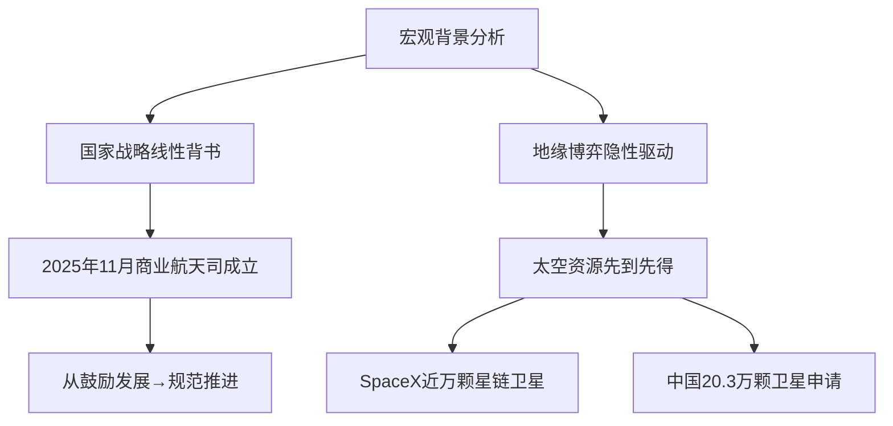
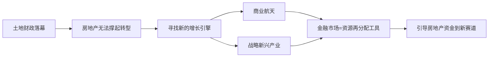
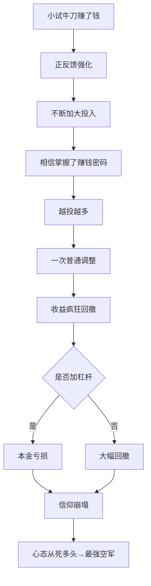

## 一、认知断层：市场永远走在认知前面

### 1.1 历史上的"看不懂"行情

| 时间 | 板块 | 特点 |
|------|------|------|
| 2014年 | 互联网+ | 传统企业转型互联网 |
| 2020年 | 新能源 | 碳中和政策驱动 |
| 近年来 | AI题材 | 人工智能技术突破 |
| 2026年 | 商业航天 | 太空资源竞争 |

> [!important] 核心逻辑
> 二级市场的底层逻辑：**市场永远走在认知的前面**

### 1.2 行业轮动规律

- A股30个行业，过去十年平均每个行业有 **4.2次** 爆发性行情
- 被单一投资者精准捕捉的却 **不足1次**
- 不跟风可能赶上4波行情；追涨杀跌可能一次都吃不到

> [!quote] 投资名言
> ==你永远赚不到你认知之外的钱==

---

## 二、研究新赛道的四步标准流程

### 2.1 第一步：宏观打底（了解顶层逻辑）



> [!note] 关键事件
>
> - **2025年11月**：商业航天司成立
> - **SpaceX**：获批新增7500颗二代卫星
> - **中国一跃**：提交20.3万颗卫星申请，创全球单次申报记录

### 2.2 第二步：分析行业壁垒

行业壁垒是判断行情是否可持续的关键。航天行业壁垒分析：

#### 2.2.1 技术壁垒

> [!tip] 研究方法
> 尽量少看自媒体，多研读：
>
> - 权威机构技术报告
> - 学术论文
> - 白皮书/蓝皮书

**目的**：

- [ ] 感知有多少事是从未想过的
- [ ] 理解技术迭代速率
- [ ] 判断与竞争对手的差距

#### 2.2.2 资金壁垒

- 航天是典型的**重资产行业**
- 资金强度足以劝退 ==99%以上== 的潜在竞争者
- 低门槛 → 供给过剩 → 价格战 → 利润压缩

#### 2.2.3 资质壁垒

- 此前格局：国家队 + 地方国资 + 产业资本
- 形成**信任门槛**
- 新玩家难以快速获得订单

> [!warning] 提醒
> 竞争越激烈，壁垒越高 → 行情可持续性越强
> 但是！**千万别马上去建仓**，继续往下看

### 2.3 第三步：客观看待差距

#### 最容易犯的错误

```
     ┌──────────────────┐
     │                  │
过度乐观 ◄─────────────► 盲目悲观
     │                  │
     │  忽视风险       错失机遇  │
     └──────────────────┘
              │
              ▼
        真正的理性
        平衡认知
        多角度看问题
```

#### 正视差距

| 对比项 | SpaceX | 中国 |
|--------|--------|------|
| 发射技术 | 领先约10年 | 追赶中 |
| 卫星成本 | ~50万美元/颗 | 数百万美元/颗 |
| 已发射卫星 | 近万颗 | 较少 |

> [!note] 工程师原话
> "能够把可复用火箭的差距定格在10年"

#### 后发优势

- [x] SpaceX已付出数百亿美元试错成本
- [x] 中国企业可直接采用成熟方案
- [x] 蓝箭航天研发投入仅为SpaceX的**五分之一**
- [x] 中国拥有全球最大的卫星应用市场
- [x] 车联网、遥感数据服务 → 千亿级需求

> [!example] 历史类比
>
> - 2010年新能源汽车：与特斯拉差距很大 → 后来的故事大家都知道
> - AI产业链
> - 互联网
> - 快速工业化
>
> ==很多时候遥遥领先未必是好事，天下第二是最安全的==

### 2.4 第四步：看清市场本质

---

## 三、金融市场的底层逻辑（核心观点）

> [!caution] 最重要的认知
> 金融市场的底层逻辑从未改变

### 3.1 经济转型与资本市场



> [!info] 资产荒的本质
> 不是没得投，而是：
>
> - 旧的投资逻辑失效
> - 新的投资逻辑还没被普遍接受

### 3.2 财富效应的真相

**为什么大家愿意往股市冲？**

> 隔壁老王买股票一天赚了20万  
> 隔壁老李买基金一天赚了七八万  
> 还在存定期的你着不着急？

==财富效应 = 看别人赚钱眼红的人性使然==

### 3.3 股市资金来源的残酷真相

```
股票市场成立目的 → 资源再分配
        │
        ▼
上市公司目的 → 融资
        │
        ▼
钱来自谁？ → 金融消费者（股民）
        │
        ▼
尤其是 → 亏损的股民
```

### 3.4 股民赚的两种钱

| 类型 | 描述 | 本质 |
|------|------|------|
| 蛋糕做大 | 跟着公司/行业/市场成长 | 击鼓传花（早来的赚晚来的）|
| 对手盘的钱 | 用更优策略击败对手 | 零和博弈式的"抢劫" |

> [!quote] 题外话
> 一些赚钱较多的投资者每年都会到庙里拜一拜——因为这些钱背后可能有悲伤的故事

---

## 四、避免成为韭菜的核心原则

### 4.1 核心原则

> [!danger] 铁律
> 在**不懂不了解**的时候，==坚决不要盲目入场==

**思考框架**：

- 别人想让你懂的时候 → 想想他为什么要让你懂
- 他们这么做的目的到底是什么？

### 4.2 行情火热时的信息特征

当行情好到人人都在讨论时：

| 你能看到的信息 | 实际情况 |
|--------------|---------|
| 顶层战略 | 大多数是死多头 |
| 行业壁垒分析 | 大多数是死多头 |
| 机构研报 | 大多数是死多头 |
| 专家解读 | 大多数是死多头 |
| 风险提示者 | 被视为短视/固执/没格局 |

### 4.3 新股民的典型循环



> [!warning] 警示
> 这种人赚的是**运气的钱**  
> 老股民赚的是**活着的钱**

---

## 五、老股民的投资哲学

### 5.1 柳行长的实践

- 专注深耕：通信和电力领域
- 2026年1月6日A股十三连阳时：开始减持卫星仓位
- 高涨幅股票从核心仓位调出 → 换到更低位置板块或沉淀成黄金

### 5.2 老股民的保守

> [!note] 为什么保守？
> 不是能力不行，而是==吃过的亏太多了==，真的知道风险有多厉害

### 5.3 操作策略

- [x] 等待一波调整
- [x] 观测回撤幅度及成交量变化
- [x] 核心板块放量下跌、情绪恐慌时适当参与
- [x] 严格执行分批建仓策略
- [x] 完成布局后基本不动核心仓位

---

## 六、核心观点总结

### 6.1 认知心态

> [!success] 第一点
> **建立"存在即合理"的认知心态**
>
> - 遇到不理解的事，不要急于杠/质疑/否定
> - 先看看是不是自己不理解的东西太多

### 6.2 接受错过

> [!success] 第二点
> **欣然接受"市场永远有机会要被错过"的事实**
>
> - 除非有无限本金或严格纪律
> - 否则不要采用"勇于试错"的打法

### 6.3 能力圈与知识圈

> [!success] 第三点
> **守住能力圈，拓展知识圈**
>
> - 接受不完美的投资决策
> - 没有任何投资能做到100%确定
> - 投资的本质：做大概率正确的事情，赚容易赚的钱
> - 不要强硬抓住每一个机会

### 6.4 活下去是真理

> [!success] 第四点
> **资本市场的底层逻辑从未改变——活下去永远是真理**
>
> - 任何股市不可能只涨不跌
> - 任何行业热潮都会起起伏伏
> - 看开看淡，放平心态
> - 拆解分析、总结转化

---

## 七、行动指南

### 面对热门板块的正确姿势

```
看到热门板块爆发
        │
        ▼
    不要急于入场
        │
        ▼
    进行系统性学习
        │
        ▼
把"看不懂"转化为"正在看懂"
        │
        ▼
    每一步夯实认知
        │
        ▼
  等待属于自己的机会
```

### 每次"看不懂"都是进步的机遇

- [ ] 完成宏观分析
- [ ] 分析行业壁垒（技术/资金/资质）
- [ ] 客观评估差距与机遇
- [ ] 理解市场本质逻辑
- [ ] 守住能力圈，等待时机

---

> [!quote] 结语
> 参与交易得到的==认知提升==，才是真正持久并且确定性的收益来源。
