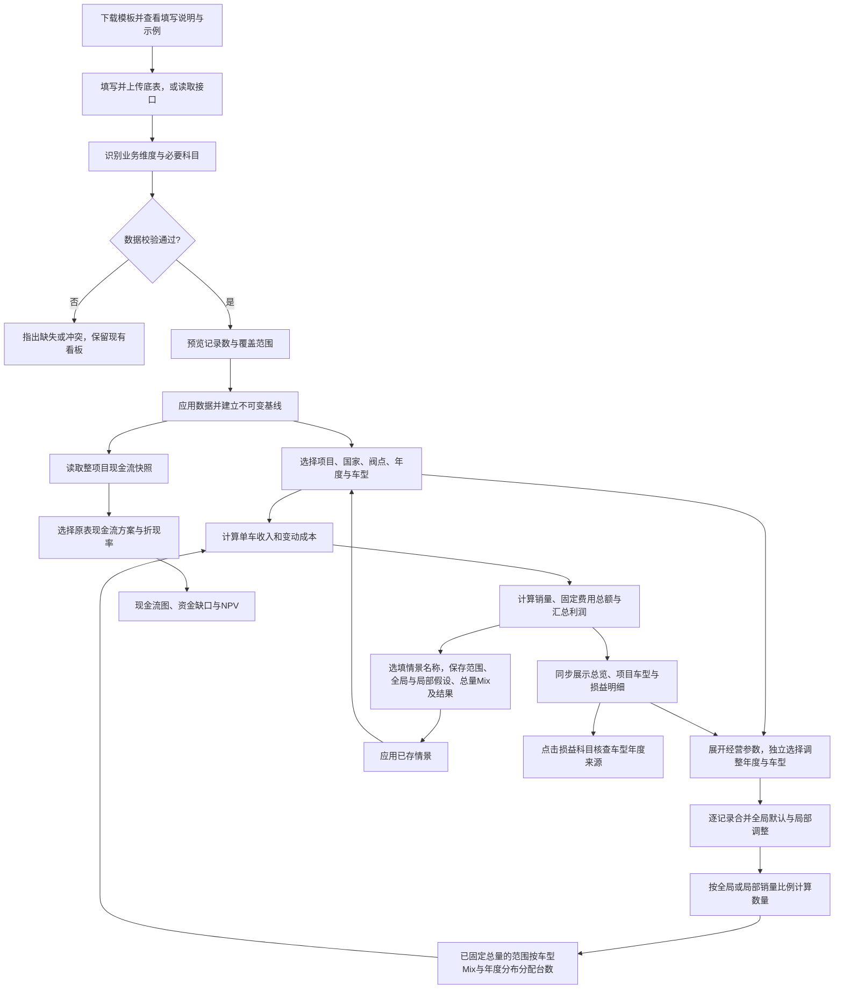

# BC 经济性分析看板 · 业务逻辑说明

版本：1.19　日期：2026年9月7日

本文面向业务使用者，说明看板为什么这样计算、各项功能按什么顺序工作，以及一个变量如何影响后续结果。内置演示数据基于《BC测算分析模板-线下.xlsx》的结构与计算口径，另外设置了年度和车型差异，不能视为实际经营实绩或原Excel缓存值。原Excel未修改，上传数据仍按自身内容计算。

个人网站访问地址为 `https://yinpengtao.cn/checkmi/`。直接输入地址即可打开，首页、导航和财务工具目录不设置入口。后续版本只更新个人网站，原 ChatGPT Sites 页面不再同步。这里保留同一套经营计算、顶部固定区的经营参数与业务筛选、独立情景比较、项目与车型表现、模板下载，以及完整损益明细；发布位置不改变任何业务口径。上传的数据与已存情景仍只保留在当前页面会话。

## 一、看板回答哪些业务问题

1. **这个项目在所选年度、车型及业务范围内能产生多少收入和利润？** 用销量、净收入、毛利率、EBIT、净利润五个指标展示结果。
2. **利润主要被哪些成本与费用消耗？** 用年度经营图、利润瀑布图和车型贡献表解释结果，并在损益明细页逐项核查。
3. **如果价格、销量或成本发生变化，经济性会怎样变化？** 展开顶部“经营参数”后调整假设，所有经营结果和损益明细同步更新；保存方案后用柱状图、年度折线图和明细表比较。
4. **老板如何检查每个车型的底层数据？** “损益明细”页从Sales、MIX一路展开到EBIT，提供单车金额、占收入比例、项目加权平均和来源记录。
5. **建设投入之后，现金何时逐步收回？** 展示原 Excel 的年度现金流、累计现金流和折现后的净现值。由于原表有两套差异明显的现金流算法，本版将它们分开展示。

默认页面展示全生命周期。金额统一使用人民币；原表中的单车金额按“元/台”理解，汇总金额主要展示为“亿元”，销量主要展示为“万台”。含税售价与现金流有其独立含税口径，不能直接与不含税利润表相加。

## 二、原 Excel 的结构与各表职责

工作簿共有17张工作表，其中6张隐藏。它并非一张已经完全打通的数据库：有的表是规则说明，有的是示例底表，有的是测算结果，还有历史版本与占位页。

| 工作表 | 业务职责 | 本版如何使用 |
|---|---|---|
| BC测算模板 | 5个车型 × 5个经营年度，以及年度和生命周期加权结果 | 经营分析与情景计算的主要基线 |
| 输入数据模板 | 国家、大区、驾驶位、出口模式、项目、状态、阀点、车型、部门、科目，按年度填写数值 | 用于理解未来数据接入结构；当前示例仅有BOM，不能独立计算利润 |
| 科目属性定义 | 科目含义、提供方、固定/变动性质、可控性与阀点要求 | 用于解释成本行为及参数关系 |
| 计算逻辑-511 | 较新的国内/海外科目、选装与操盘口径说明及示例 | 作为业务定义参考；未直接替换主测算表算法 |
| 计算逻辑、计算逻辑-新 | 早期口径与示例，均隐藏 | 辅助识别规则演变及差异 |
| 财务指标 | 当前阀点与目标、不同阶段的指标框架 | 参考指标体系；18%毛利率是目标示例，不作为所有项目的统一考核线 |
| 毛利率目标制定 | 不同配置的价格、成本、毛利与目标降本关系 | 解释目标成本思路；暂未上线独立目标成本反推功能 |
| 现金流及投资回收期 | SOP前三年投入、五年经营现金流、NPV、IRR、回收期 | 展示两套原表现金流快照，并支持修改折现率 |
| 车型总投资-立项 | 部门、费用类别与生命周期投资预算 | 用于理解投资构成，尚未与情景利润强行关联 |
| 阀点变化底稿、阀点变化展示 | 比较当前与上一阀点的部门投资变化；展示页隐藏 | 用于理解版本管理；本版先通过阀点筛选隔离版本 |
| 一二三级科目 | 投资与费用的分级分类目录 | 作为科目字典来源 |
| 专用投资分析1、专用投资分析（待讨论） | 专用投资分析草稿，均隐藏 | 参考，不作为已确认计算口径 |
| 展示模板、-----> | 空白展示页与分隔页，前者隐藏 | 不参与计算 |

**不能把不同项目示例拼成一个真实项目。** 主测算表的车型A～E、输入模板中的Lemans项目、投资明细中的Modena项目是不同示例。没有明确对应关系时，不将它们自动连接。

## 三、业务处理的串行顺序

### 1. 接入与识别

支持三种入口：

- **完整Excel**：识别原结构的“BC测算模板”，读取5个年度、5个车型的25条明细，而不是把横向合计列当作新增业务记录。
- **标准底表**：CSV、JSON或标准Excel。下载模板有“填写说明”“数据填写”“填写示例”三页，系统优先读取“数据填写”，不会把说明或示例算作业务数据；其他标准Excel读取第一张表。支持模板中文表头及接口英文字段。每条记录代表一个“项目 × 国家 × 阀点 × 车型 × 年度”。单车成本以正数输入，系统统一转换为扣减项。
- **数据接口**：主动读取用户指定的HTTPS JSON地址，使用与标准底表相同的业务字段。当前支持允许浏览器访问、无需私密密钥的接口；不代表已经连接任何企业经营系统，也不自动定时刷新。

文件在当前浏览器解析。导入前展示覆盖范围；点击“应用此数据”后才替换当前基线，同时重置情景参数与本次会话保存的情景。刷新页面会恢复内置演示数据，上传内容和情景不会自动永久保存。

### 2. 校验

检查必要字段、数值有效性、重复记录、售价与销量边界，以及关键收入/利润合计。完整Excel还检查指定行的科目名称、固定与变动费用的合计。读到没有计算结果的公式时，要求先在Excel中重算保存。

**缺失不等于零。** 必要科目缺失会停止导入；确实无发生额的标准底表科目必须填0。原完整模板中的空白预留行，可以按其原计算结构视为0。

当前原始“输入数据模板”只有BOM成本，缺销量、售价、制造费用、研发分摊等信息。系统会提示补齐，不以其他项目的数据填补。

### 3. 选择分析范围

年度与车型筛选同时影响经营总览、损益明细和损益表 Excel 导出。各经营页面的参数与筛选是同一组设置，切换页面不会建立另一套假设。多项目或多国家底表还可按对应维度筛选。存在多个阀点时，默认选取导入记录中的第一个阀点，用户可以切换；不会把不同阀点的同一业务重复汇总。第一个阀点不一定是最新阀点，使用时应确认版本。

没有数据的筛选组合显示无数据提示。现金流快照属于独立的整项目视图，不跟随这些经营筛选。

## 四、指标计算链路

### 1. 从量价到收入

单车净收入 = MSRP含税售价 + VAT扣减 + 收入抵减项。

在主表的13%增值税假设下，VAT扣减 = −MSRP ÷ 1.13 × 13%。收入抵减包括积分权益、展车折扣、金融贴息、购置税补贴等，原主表按固定单车金额输入。

总净收入 = 各车型各年度的单车净收入 × 对应销量，再加总。

**售价变化的联动：** VAT随售价变化；质保金按基线售价比例联动；消费税随净收入变化；城建及教育附加税随VAT、BOM进项和消费税联动。本版的金融贴息等抵减项仍按主表的固定金额处理，只有单独调整“收入抵减”时才改变。说明页上的其他公式不会未经确认自动覆盖主表。

### 2. 从收入到毛利

毛利 = 净收入 − 成本总额。

本版成本包含：BOM、单列赠送配置、税金、制造费用、运费保险清关、质保金、其他成本。损益表保留费用负数扣减关系；瀑布图用减少方向表示费用影响。

税金主要保留原主表逻辑：消费税按净收入的基线比例计算；城建及教育附加税按12%的模板系数计算；关税等未单独调整的原输入维持单车金额。**这些是模板参数与建模口径，不是税务政策判断。** 标准底表采用国内BC税费算法；海外转移定价、CIF、惩罚性关税等需要单独扩展。

### 3. 从毛利到EBIT

EBIT = 毛利 − 研发费用分摊 − 销交服费用 − 市场费用 − 集团分摊 − 其他已计入费用。

EBIT用于衡量经营利润，不考虑利息等财务费用。集团分摊在底表基线、当前调整及全部已存情景中始终计入EBIT，不再提供开关。分摊金额沿用底表自身的“集团分摊÷净收入”比例随净收入联动；模板示例比例为0.2%。原主表第70行未进入第53行费用合计，所以看板在原表费用与EBIT基础上补计这笔扣减，再重新计算所得税和净利润。原Excel及来源记录保留原值，核查时须区分原表缓存与看板统一口径。

### 4. 从EBIT到净利润

所得税 = max(年度EBIT, 0) × 所得税率。

净利润 = EBIT − 所得税，默认税率15%。先在同一项目、国家、年度内汇总所选车型，再计税；不同项目、国家和年度分别计算后加总。模型不确认亏损产生的税收收益，不计算跨年亏损弥补。

车型筛选后的净利润，是该业务范围独立计算的情景结果。若各车型有盈有亏，分别筛选得到的税后利润，可能不等于整项目净利润；这是计税范围改变造成的，不能直接相加。

### 5. 加权与汇总

| 指标 | 汇总方法 | 避免的误区 |
|---|---|---|
| 销量 | 明细销量相加 | 不加入已经汇总的Average或生命周期合计列 |
| 净收入、毛利、EBIT | 各条记录的金额加总 | 不将元/台直接当成项目金额 |
| 单车净收入、单车毛利、单车EBIT | 对应总金额 ÷ 总销量 | 不对不同销量车型做简单平均；年度折线使用该年度销量 |
| 毛利率 | 总毛利 ÷ 总净收入 | 不直接平均各车型毛利率 |
| 销量占比MIX | 车型销量 ÷ 当前范围总销量 | 生命周期占比使用整个生命周期销量 |
| 生命周期净利润 | 各年度、项目、国家税后利润加总 | 不先把全部年份盈亏抵消再统一计税 |

零销量时，单车指标显示“—”；在固定总额模式下，固定费用仍然发生，因此EBIT可以为负。总收入为零时，毛利率显示“—”。

## 五、顶部经营参数与情景比较如何工作

### 可调整的业务变量

| 变量 | 改变什么 | 主要影响路径 |
|---|---|---|
| 含税售价 | 调整范围内的MSRP按比例变化 | 净收入、VAT、消费税、附加税、质保金、毛利、利润 |
| 销售数量 | 未固定总量的范围按比例变化；固定总量的范围由总量与Mix分配 | 收入、变动成本、固定费用单车分摊、利润 |
| BOM单车成本 | 第20行BOM金额按比例变化 | 材料成本、进项税相关附加税、毛利、利润 |
| 固定制造费用 | 固定制造费用总额或单车金额按所选模式变化 | 制造费用、毛利、利润 |
| 研发投入 | 研发分摊基线形成的总额或单车金额变化 | EBIT、净利润；本版不直接改变投资现金流计划 |
| 收入抵减 | 现有抵减金额绝对值按比例变化 | 净收入、消费税、附加税、毛利、利润 |

调整显示为“相对基线的百分比”。例如BOM为−5%，表示成本下降5%；收入抵减为+10%，表示优惠抵减扩大10%，通常降低利润。全局默认和局部假设共同作用于各条记录，原始底表基线不变。顶部筛选只决定查看范围，不决定局部调整对象。

系统只保留“底表基线”和“调整后”两种实时口径，不提供自动组合的参数方案，不替用户给方案作好坏判断。参数由用户逐项输入或拖动，也可点击“恢复全部基线”同时清除全局、局部参数和固定总量与Mix。变量之间没有自动需求弹性：例如涨价不会自动降低销量，用户应自行输入其销量判断。用户主动保存的方案只是当时调整后结果的快照，情景比较继续保留。

### 一套面板，按需切换调整对象

展开“经营参数”，含税售价、销售数量、BOM、固定制造、研发、收入抵减六项滑块与手填同时可见。默认“全部车型、全部年度”编辑全局默认值，不再逐车型铺开行，也无需先选一个指标。

1. 顶部“调整对象”旁始终显示“选择车型”和“选择年度”两个带底色的多选框，无需先展开入口。直接选择对象，仍在这套六项控件中操作。例如选A设置售价+3%、BOM−5%，再切到B设置售价−2%，A的值会保留。切换对象只切换编辑内容，不复制或清除原有设置。
2. 车型和年度均可多选；选定范围是两者的交集。“全部”表示该维度不限制。两项都为全部时修改全局默认，已有局部项继续保持自己的独立值；至少限定一项时，修改命中记录的局部值。车型始终按项目、国家、阀点和车型区分。
3. “已单独设置”直接展示车型、年度及具体幅度，例如“A / 2028：含税售价 +5%”。同车型、相同设置的年度合并为一条；幅度不同的年度分开显示。点击记录回到相应对象继续改，点击叉号撤销这条记录对应的单独设置。点击“回到统一调整”重新编辑统一值。记录不是另一套情景，不会新增或应用情景快照。
4. **局部值替换同项全局默认，均相对底表，不叠加。** 全局售价+5%、A售价+3%时，A使用底表售价×1.03，其余未单独设置的记录使用×1.05。只改实际操作的指标，其余五项不变。
5. 选中范围的同项数值不同时，输入框显示“多值”，滑块零位置只是新值入口，不代表平均值。只有拖动或填写这一项，才把它统一设置给命中记录。若要保留年度差别，直接选择单个年度编辑。
6. 每项“使用统一值”仅清除此范围的该项单独设置。撤销修改记录则清除该记录对应车型年度的全部单独设置，其他记录保留。取消原来的“局部调整”大明细表。恢复全部基线同时清空所有参数与Mix，并把调参对象和销量分配选择恢复默认。
7. “销量与 Mix”默认折叠。展开查看或已有分配时，上方“销售数量”直接改为总台数输入与滑块，和“分配年度”右侧的总销量框同步；不再停用销售数量。修改总台数保留Mix占比与锁定状态，修改占比保持总台数不变。销售数量下标明该组项目／分配年度及“全部车型”，点击可返回Mix。仅查看或切换范围不改变经营结果；没有已存分配且收起Mix时，销售数量使用原来的百分比调整。
8. 查看范围与调整范围仍相互独立；各经营页面共享这套参数。开始编辑会把展示情景切回当前调整，对照情景及已存方案保留。计算顺序、损益、导出与情景保存关系不变。

销售数量处的Mix总量始终对应它下方标注的分配范围，与顶部用于价格、成本等单独设置的车型／年度对象分开。要换总量的年度，在Mix的“分配年度”或已有分配记录中选择；有多组年度分配时，只改当前这一组，其余保留。若所选年度与已有分配部分重叠，两处总量编辑均暂停，先选已有记录或其他年度。

### 特殊调整

原“费用与计税口径”改为“特殊调整”，默认可折叠，包含三项：

| 项目 | 可操作内容 | 影响顺序与范围 |
|---|---|---|
| 固定费用 | 选择“总额不变”或“单车不变” | 同时作用于固定制造、研发分摊和固定销交服；先确定费用随销量变化方式，再计算毛利与EBIT。总额不变时，零销量仍保留固定费用 |
| 所得税率 | 手填税率，默认15%，当前可输入0%～50% | 在各项目、国家、年度的EBIT汇总后，对正利润计税，影响净利润，不改变毛利或EBIT |
| 关税税率 | 预留位置，显示“暂未启用”，不可填写 | 不保存假设、不参与任何重算；底表已有的关税金额继续沿原有成本口径处理 |

上述固定费用方式和所得税率作用于整套情景，不随单独设置的车型／年度对象缩小范围。保存情景时一并保存这两项；查看、应用及导出使用所选情景自己的设置。集团分摊作为统一计算规则始终生效。

### 固定总量与 Mix 分配

这项操作约束销量合计，用于总量确定而车型结构变化的测算。不是需求预测，也不会自动改变售价或成本单价。

1. 展开“销量与 Mix”，直接显示总销量、各车型占比及分配台数，不必先新增范围。只有多个项目口径时才显示项目选择；在“分配年度”选择要约束的年度，右侧直接填写总销量（台）。“全部年度合计”表示该项目现有全部年度的总量，选择一个年度则表示该年度总量；也可多选几个年度作为合计范围。下方车型使用紧凑卡片，宽屏三列、中等宽度两列、手机单列；每张卡片保留占比滑块、手填、分配台数、底表台数和联动方式。
2. 初始预览取所选年度当前调整后的销量和车型结构，不会自动启用固定分配。实际修改总销量、任一车型占比或联动方式时，才保存此组分配并更新经营结果。总量可在上方“销售数量”或“分配年度”右侧任一输入框手填为100万台，即1,000,000台；上方也可拖动滑块调整。两处编辑同一组总量，输入按整台接受，不使用百分比叠加。总量改变后，占比、保持占比的车型以及原年度分配权重不变，车型台数重新整台分配，随后经营指标及损益表更新。
3. 各车型直接显示可拖动和手填的占比、分配台数及底表台数。联动方式默认为“自动平衡”，可点击改为“保持占比”。拖动或输入A的占比后，其他未锁定车型按各自当前占比共同分摊剩余份额，合计始终为100%。
4. “保持占比”锁定的是该车型的Mix占比；编辑其他车型时此占比不变。改变项目总量时，锁定车型的销量仍随总量变化。不能把可编辑车型提高到“100%减去其他已锁定占比”以上；只剩一款未锁定车型时，其占比已由剩余份额确定，须先解锁另一款才能改变结构。
5. 例如总量100万台，初始A为20%、B为30%、C为50%；把A改为40%，B与C按30:50分摊剩余60%，变为22.5%和37.5%，销量分别为40万、22.5万、37.5万台。若B锁定30%，A改为40%后C为30%。该例仅用于说明分配规则，不是默认经营假设。
6. Mix精度为0.01个百分点。先按Mix把整数总量分给车型，再按各车型启用时的年度销量分布分给现有车型年度；每步先取整数，再按小数余数从大到小补足，不足一台的尾差有确定分配顺序。台数合计精确等于设定总量，实际台数占比可能与目标Mix存在整台舍入差。
7. 多年度范围内，改变Mix保持每款车型启用时的年度分布；某车型当时销量为零则使用底表年度分布，底表也全为零则均分到已有年度。不会补出底表没有的车型年度。若希望分别约束每年总量，应按年度建立不同范围。
8. 可以保留多组不重叠的年度分配，“已设置”记录显示年度和总台数，点击即可继续修改。切换年度显示该范围的已有分配或当前预览。同一车型年度不能重复属于两组；交叉重叠时提示点击已有记录继续编辑，或改选其他年度，避免重复分配。切换看板筛选只决定查看的分配结果，不把筛选后的少数车型重新分到100%。
9. 数量生效顺序为：先取得全局或局部销量比例，再由固定总量范围的分配台数覆盖；因此全局销量滑块不再改变这些范围的合计。点击“恢复原销量设置”后，恢复其原有统一／单独销量比例。其他项目和年度不受影响。
10. 总量可以为零，此时销量、收入和变动成本为零，固定总额模式仍保留固定费用；单车指标和实际Mix显示“—”。目标Mix仍保留，便于再次填写非零总量。

### 参数、结果与保存的依赖

每条记录先取得有效量价成本参数，再确定最终销量，然后计算单车收入、税费、成本、固定费用及利润。汇总后的经营总览、年度图、车型对比、损益表和情景比较共享这一结果。Mix变化会改变加权单车指标与利润率；所得税继续按年度、项目和国家汇总后计算。

保存情景同时保留全局与局部幅度、各范围总量、目标Mix、锁定状态、年度分布、查看范围和结果。应用情景恢复整套设置，后续修改不会改写已存情景。恢复全部基线或应用新底表时清空这些调整。现金流快照保持独立。

损益Excel使用相同分配台数和金额；“口径与参数”页将每个相关车型年度的Mix分配台数保存为整数数值，并保留其有效的非销量局部参数。已被固定台数替代的局部销量比例不再作为有效销量参数列出。

### 全页展示情景与对照情景

经营总览和项目与车型的顶部筛选器右侧提供“展示情景”和“对照情景”，与经营参数、项目、年度和车型筛选放在同一行，可从底表基线、当前调整、已命名的保存方案中任意选择。例如展示“方案B”、对照“方案A”，前面的页面就能直接比较两套已存假设；点击“交换”对调两者。无需先应用已存方案，也不会覆盖当前正在编辑的参数。

1. 两套假设都按顶部当前项目、国家、阀点、年度、车型筛选重新测算，始终使用相同记录范围。保存时的查看范围不会自动带过来；其局部假设仍只作用于保存时设定的具体记录，固定总量也不会因查看范围变窄而重新分配。
2. 经营总览的大数字对应展示情景，小数值和差额对应对照情景；生命周期毛利、EBIT分别比较这两个情景，图例显示实际名称。车型年度图、车型贡献明细使用同一组展示和对照；总览的盈亏平衡小组件使用展示情景的有效参数。
3. 车型年度对比中的两个口径按钮改为所选情景的名称；切换按钮看对应情景的车型年度线、单年柱状图和数值矩阵。数值下钻把展示／对照角色带入损益表，继续查看同一情景和记录范围。
4. 损益表工具栏的“查看数据”直接列出底表基线、当前调整和全部已保存情景，选择后按当前业务筛选重算对应假设，直接显示完整损益表，不必先应用方案。选择“差额”时，再显示“展示情景”和“对照情景”两个选择框，可任选两套方案；差额固定为展示减对照，比率差额使用百分点。该页不再重复显示顶部情景栏。底表原始输入仍可在科目明细中追溯。
5. 选择情景只改变查看，不修改当前参数；实际编辑量价成本或总量Mix时，展示情景自动回到“当前调整”，对照情景保留。保存按钮始终保存当前调整及其结果。点击已有方案的“应用”才把那套参数、Mix和原保存查看范围复制到当前调整。
6. 删除已被选中的方案后，展示回退到当前调整，对照回退到底表基线。新底表或恢复全部基线也恢复默认对照。允许选择同一情景作对照，此时差额为零，不制造变化。
7. 独立“情景比较”页继续保留每套方案保存时的范围与结果，用于对比原保存快照；该页的跨范围提示继续适用。它与前述“按当前筛选重算已存假设”各有清楚职责，不改写已存结果。
8. 导出所选情景时，Excel记录其真实名称及有效参数；导出差额时，参数页分别列出两套情景的参数与Mix分配台数，避免把已存方案的数据标为当前调整。现金流快照与数据口径页不使用经营情景选择。

### 固定费用的两种业务假设

**默认：固定总额不变。** 用“基线单车固定费用 × 基线销量”还原固定总额，再按情景销量分摊。此规则同时适用于固定制造、研发分摊、固定销交服。

例如基线5万台、固定制造4,000元/台，总额是2亿元。销量下降至4万台，若固定总额仍为2亿元，则单车固定制造费用变为5,000元。即使销量为0，2亿元仍作为成本发生。

**可选：单车费用不变。** 维持固定费用的单车金额，随销量成比例形成总额。以上例而言，4万台时总额变为1.6亿元。该模式更接近对原表单车数值做简单量变外推，但不代表固定资源一定能随销量缩减。

### 页面顺序与调整、查看、保存的顺序

页面顺序为：**经营总览 → 项目与车型 → 情景比较 → 现金流快照 → 损益明细 → 数据与口径**。导航、经营参数入口及业务筛选共同固定在顶部：第一行切换分析页面，第二行依次显示经营参数、项目、年度、车型，右侧放置展示与对照情景及交换按钮，不再另占一行；多国家或多阀点底表增加相应选择。各页不再重复展示占空间的大标题，保留图表和功能名称。数据与口径固定放在最后；损益明细继续提供完整核查能力。

1. 默认先展示经营数据。顶部“经营参数”入口与项目、年度、车型筛选并列在一行。点击入口后，在固定区域下方向下展开编辑区，在原页面内修改含税售价、销售数量、BOM、固定制造费用、研发投入或收入抵减；再次点击同一入口收起。滑动立即生效；手填完整数字后按回车或离开输入框生效，不需要另点“应用”。从下方分析卡片点击“调整经营参数”时，会回到页面顶部并展开。
2. 同一组结果同时更新指标卡、年度图、利润瀑布、项目与车型、完整损益表，以及情景比较中的调整后结果。固定区域保留当前筛选和已调整项数，经营结果由下方指标卡与图表展示。编辑区随正文滚动，仅导航和操作栏保持固定；在页面下方点击参数入口时，会回到顶部并展示编辑区。窄屏的导航与整条业务操作栏分别可横向滚动，保持筛选与情景对照的先后顺序。现金流快照不跟随经营参数。
3. 可在输入框填写情景名称，也可直接点击“加入情景比较”，保存当时的业务筛选、全局参数、局部参数、总量与Mix及结果。参数编辑区和比较页均使用相同操作。名称选填；留空或只有空白时，自动使用“情景 1”“情景 2”等名称，从1起选择当前未使用的最小编号。自填名称最长40字符，自动清理首尾及连续空格；与已有名称或实时口径名称重复时加序号，防止混淆。保存后保留当前页面，可继续调参；点击“查看情景比较”收起参数区并进入独立比较页。
4. 最多保留最近4组情景。再次调参不会改写已存方案；可移除方案，也可点击“应用”同时恢复该方案的全局参数、局部参数、总量与Mix及业务范围。
5. 比较页用柱状图和年度折线图看差异，用明细表核查参数。跨项目、国家、阀点、年度或车型范围时，差额可能同时来自范围和参数，不能全部归因为参数变化。
6. 收起参数区只减少展示占用，不清空参数、筛选、当前结果或已存情景。顶部入口保留已调整项数，方便判断当前数据是否仍为底表基线。切换经营页面也不会另建一套假设。
7. 在损益明细页导出完整损益表 Excel 可保留此次核查口径。顶部不再提供独立的“导出结果”。上传并应用新底表会清空旧情景、恢复参数基线并收起参数区；刷新页面也会清空本次会话数据。

现金流仍是独立的原表快照。顶部经营参数联动上述经营结果；投资现金流需要另外的付款与投资计划，边界见第七节。

### 情景比较的图表与明细怎么配合

进入“情景比较”页后，先展示方案利润柱状图与年度利润变化，再在下方展示毛利和EBIT变动瀑布图。比较图默认同时展示“底表基线”“调整后”和最多4组已存情景。尚未保存时展示基线与调整后结果。

- **方案利润对比柱状图**：按科目分为EBIT、净利润两组；每组内部并列展示底表基线、当前调整和各已存情景的同一科目。每种颜色对应一种情景，与年度折线图一致。共用亿元数值轴，保留零基准线和负值；无记录保持空缺，不显示成零。
- **年度利润折线图**：每组方案一条线，可切换EBIT或净利润。用同一组年度坐标查看差异集中出现在哪一年，不改变经营假设。只覆盖一个年度时显示数据点。
- **选择参与比较的方案**：点击方案名称显示或隐藏该方案，同时作用于柱状图、折线图和瀑布图的可选方案。只改变比较对象，不改变顶部参数、业务筛选或已存结果，至少保留一组可见方案。
- **图表对应数值**：可展开查看所有可见方案的总EBIT、总净利润和逐年数据。图形难以区分时，用数值核对。
- **已存情景明细表**：保留全部业务范围、量价成本假设、固定费用模式、所得税率和结果；集团分摊统一计入EBIT；使用用户填写或自动生成的情景名称，与图例、提示框、瀑布图选项一一对应；参数清单可展开查看。应用方案时，调整后结果会恢复该方案的条件；移除后，该方案同时退出图和表。

经营参数变化只更新“调整后”，筛选变化同时更新调整后结果与同范围基线。已存情景始终使用保存时的范围和年度结果，不随当前筛选重新计算。新增方案后柱状图与折线图自动加入该方案，也可以在瀑布图中选为起点或终点。

方案覆盖的项目、国家、阀点、车型或年度不同时，会提示“业务范围不同”，避免把规模变化完全归因于参数。缺失的年度是空缺，不能画成零利润，也不跨空缺连接。相同结果的曲线会重合；不为增强视觉差异而改动数据。标准底表缺少记录与零销量但仍承担固定费用的方案也分别处理。

### 调整前后瀑布图的业务顺序

情景比较在利润规模与年度变化图下方展示“毛利变动”和“EBIT 变动”两张瀑布图。默认起点为同范围底表基线、终点为调整后；用户也可以从当前参与比较的已存方案中选择两组。隐藏方案后，瀑布图会改用仍可见的比较对象。只剩一组或其中一组没有业务记录时，不生成变动图。选择图表对象不会回写经营参数。

1. 先读取起点与终点的经营结果及成本、费用金额。
2. 每项差额＝终点金额－起点金额。费用沿用负数口径，例如从−100变为−80，差额为+20。
3. **毛利变动**：起点毛利＋净收入差额＋BOM成本差额＋赠送配置差额＋税金及附加差额＋制造费用差额＋运费保险清关差额＋质保差额＋其他成本差额＝终点毛利。其他成本包括原表预留项及未分解差额。
4. **EBIT 变动**：起点EBIT＋毛利差额＋研发分摊差额＋销交服差额＋市场费用差额＋集团分摊差额＋其他费用差额＝终点EBIT。其他费用保留源表费用合计与已列子项的差额；毛利已经包含收入和成本变化，不在这张图再次相加。
5. 图下可展开对应科目的起点、终点、差额及利润合计；悬停图形可查看金额（元）。

两图使用亿元、带正负号的差额和一致的增减配色，起点与终点使用同一种中性色。数值很大而变动较小时，纵轴聚焦累计变动区间，并明确标注；跨越零时保留零线。没有变化的科目显示零，不预设改善或承压结论。金额计算保留精度，展示时按位数处理；低于一分钱显示精度的差异不会被强调为一项变化。

这是**损益科目金额差额拆分**。价格、销量或成本参数可能同时影响多项，例如售价变化会同时改变净收入、税金和质保；图形不把这些联动重复算成独立参数贡献。两组业务范围不同的时候，差额也包含范围变化，页面会提示。参数变化、固定费用模式、集团分摊和源表差额均沿用同一套经营计算。

## 六、图表与功能之间的关系

| 功能 | 依赖输入 | 输出和用途 | 影响其他功能 |
|---|---|---|---|
| 数据接入 | 完整Excel或标准底表 | 建立基线及可筛选业务维度 | 更新经营页面；如含现金流则更新现金流快照；清空旧情景 |
| 业务筛选 | 项目、国家、阀点、年度、车型 | 定义当前分析范围 | 总览、项目车型、比较中的调整后结果、损益和导出统一变化 |
| 经营总览指标卡 | 当前范围与情景 | 汇总核心结果、对比基线 | 是各图表共同的核对总数 |
| 年度经营图 | 同一范围的基线及当前年度毛利、EBIT | 毛利与毛利比较，EBIT与EBIT比较；各自按年度展示 | 服从筛选与情景，收起参数区后仍可查看 |
| 总览盈亏平衡小组件 | 展示情景的量价成本、固定费用与销量结构 | 经营保本销量及同范围情景销量 | 随筛选和展示情景更新；不改变现金流 |
| 利润瀑布图 | 毛利及各费用 | 解释毛利如何扣减成EBIT | 终点与EBIT指标卡一致 |
| 车型贡献表 | 车型销量、收入和利润 | 比较单车盈利和规模贡献 | 点击车型会缩小全局经营范围 |
| 顶部经营参数入口 | 基线及用户判断 | 计算量价成本变化结果 | 联动全部经营指标；不改变现金流快照 |
| 情景比较（独立页面） | 同范围基线、调整后结果、已存范围与结果 | 两张瀑布图分解毛利和EBIT差额；柱状图、折线图和明细核查结果 | 共同选择参与方案，瀑布图再选两组；应用情景恢复参数与筛选 |
| 项目与车型 | 当前范围及所选情景的车型年度结果 | 车型年度折线、关注年度柱状图、可下钻数值表 | 合计回到总览EBIT；点击数值带入完整范围查看损益 |
| 损益表 Excel 导出 | 当前业务范围、参数与损益展示方式 | 完整车型损益表及口径与参数两张工作表 | 对应页面当前数值，保留精度、分组、配色和冻结表头；不修改底表 |
| 现金流分析 | 整项目原表现金流与折现率 | 年度、累计、资金缺口、NPV | 仅在本页面内联动 |
| 数据与口径（最后一页） | 原表结构、模型规则、审阅问题 | 下载填写模板、查看字段含义及业务说明 | 帮助建立正确底表与解释差异 |
| 损益明细 | 同一组经营结果与底表明细 | 按车型、MIX、科目核查从Sales到EBIT | 与总览合计一致；支持基线差额和底层来源检查 |

### 页面文案与展示边界

分析页面以指标名称、单位、筛选范围、图例和数值展示为主。图表直接命名为“单车EBIT”“车型EBIT”“年度利润对比”等，不指定阅读顺序，不给出系统推荐或方案优劣结论。去掉重复的调参生效提示和操作性长句，保留零销量、无有效分母、跨范围比较及现金流独立口径等影响数据解释的说明。保存数量上限、刷新清空等会话规则保留在文档中，不在操作页面反复展示；保存处仅保留名称输入框和操作按钮。完整计算顺序与功能关系集中保留在本业务文档和“数据与口径”页。

### 核心指标卡的读数顺序

指标卡先展示当前口径的主数值与单位，再给出相关业务量，底部统一展示同一筛选范围的底表基线及差额。没有修改参数时，主数值就是基线；修改后，它就是调整后结果。五张卡分别用不同的轻配色、图标和分区帮助识别，颜色固定对应指标，不表示好坏、目标达成率或系统推荐。

| 主指标 | 补充信息 | 业务关系 |
|---|---|---|
| 销售数量（万台） | 当前车型组合数、覆盖年度数 | 车型按项目、国家、阀点、车型分别计数；年度按当前记录覆盖范围计数 |
| 净收入（亿元） | 单车净收入（万元） | 净收入总额 ÷ 当前销量；零销量时显示“—” |
| 毛利率（%） | 毛利总额（亿元） | 毛利总额 ÷ 净收入，不是车型毛利率的简单平均 |
| EBIT（亿元） | EBIT率（%） | EBIT ÷ 净收入 |
| 净利润（测算，亿元） | 净利率（%） | 按原有项目、国家、年度口径计税后的净利润 ÷ 净收入 |

主值、基线与差额使用相同单位；毛利率差额用“个百分点”。差额=调整后−同范围底表基线，以“增加”“减少”描述数值变化，不自动评价方案。无有效收入分母时，利润率与其差额显示“—”；小于显示精度的非零差异提示“变化不足0.01”，不称为完全相同。已存情景不会回写这些实时指标卡。

### 项目与车型：年度对比与明细

“项目与车型”页最上方直接展示**车型年度对比**，经营总览的“车型贡献”旁也提供“车型对比”直达按钮。当前车型或年度筛选受限时，可点击“查看全部车型与年度”，只清除这两个查看条件，保留项目、国家与阀点。

1. 选择指标：EBIT总额（亿元）、单车EBIT（元/台）、毛利率（%）、净收入（亿元）、销量（万台）。默认EBIT总额，图表标题和单位随选择更新。
2. 选择底表基线或调整后，同一张图只显示一种口径；可同时勾选多款车型。图例也可显示或隐藏某款车型，至少保留一款。
3. 主图横轴为年度，每款车型一条折线；相同车型的颜色和点形在隐藏、筛选后保持稳定。悬停同一年可比较各款数值；真实数据平稳时保留水平线，不制造波动。
4. 点击主图中的年度，或用年度选择框选择，下方横向柱状图比较该年度各车型，按数值排序。此操作只改变图表焦点，不改经营参数，也不改顶部年度筛选。
5. 车型年度数值表与图使用相同指标和单位。点击列头切换关注年度；点击单元格进入对应项目、国家、阀点、车型、年度的损益表，同时带入基线或调整后口径。单车EBIT使用单车损益视图，其他指标使用总额视图，表中标明其实际单位。
6. 修改全局或局部假设后，调整后结果重新逐车型年度汇总；受影响的点、柱和数值一起更新。比较车型和切换指标不会改写假设，也不会改变已保存情景。

单车EBIT=车型年度EBIT合计÷销量合计；毛利率=毛利合计÷净收入合计。缺失年度保持空缺，折线不跨空缺相连；零销量的单车指标留空，固定总额造成的负EBIT仍显示。仅一个年度时显示点及年度柱状图。不同业务范围的同名车型分开标注。这里不拆分独立计税后的车型净利润。

“项目与车型”保留上述年度折线、单年柱状图和数值矩阵。“项目汇总与经营明细”折叠区及其项目卡片、组合统计与重复车型表已移除；总览的车型贡献表和完整损益表仍可核查车型数据。

### 经营总览的盈亏平衡小组件

保留经营总览中“毛利至EBIT”旁的小组件，展示所选情景、当前范围的经营盈亏平衡销量，单位为万台，并列出同一情景销量。独立盈亏平衡页面不再提供。

计算顺序：取得展示情景的统一参数、车型年度单独设置与Mix分配台数；按当前筛选计算有效销量结构、固定费用总额和加权单车边际贡献；固定总额模式下，保本销量=固定费用总额÷加权单车边际贡献。保持价格、单位变动成本及销量结构不变，仅按同比例缩放销量使EBIT为0。

单车费用不变模式不提供独立固定费用保本点；边际贡献不为正或无可用销量结构时显示“—”。调整后全为零销量时使用底表结构及当前其他假设推导；该指标不表示投资现金流回收、产能或市场需求。筛选或展示情景变化会更新小组件；它不改变任何参数，也不更新现金流快照。

### 生命周期经营表现的分组方式

生命周期经营表现按指标拆成两组：毛利与EBIT各一组，每组内部按年度排列。柱形展示年度总额（左轴：亿元），在柱形上叠加对应的单车金额折线（右轴：元/台）。单车毛利＝当年毛利总额÷当年销量；单车EBIT＝当年EBIT总额÷当年销量。先汇总该年度所选车型，再除以该年度销量，不对各车型单车金额做简单平均。

同一年度的展示与对照情景总额并排，单车折线同步对比。展示情景使用彩色柱与实线，对照情景使用灰色柱与虚线；图例及悬浮数值显示实际情景名称。总额或单车金额任一有差异就保留双方；两者都一致时只绘制展示情景。单车折线在零销量年度留空，仍保留该年度总额及可能发生的固定费用亏损；缺失年度不填成零，只有一个年度时显示一个点。

两套纵轴分别标明单位，柱高与折线高度不能直接当成同一金额比较。数值来自与指标卡、损益表相同的经营结果；先按有效假设（含总销量与Mix）计算，再应用同一查看范围按年度汇总。因此调整假设或切换展示／对照情景、车型、年度时，总额柱与单车折线一起更新。默认对照为底表基线；收起参数区或切换页面不改变假设。

### 折线展示方式

生命周期单车毛利／EBIT、车型年度对比、情景年度利润、年度及累计现金流统一使用平滑线。线条仍通过原年度的数据点，悬浮数值与损益明细不变；平滑仅改变点之间的连接方式，不新增年份或预测数值。缺失年度保持断点，零销量导致的单车空值不补零；只有一个有效年度时仍显示数据点。

### 标准模板怎么填写

“数据与口径”和“接入数据”窗口均提供Excel模板下载。模板的“数据填写”页初始为空，保留第1行中文字段名，从第2行填入真实数据。“填写示例”是独立参考页，不会自动进入看板；把示例复制到数据填写页测试时，结果仍然是示例。

- 一行是一组“项目 × 国家 × 阀点 × 车型 × 年度”，不要填写合计行。最多2,000条记录，上传文件不超过10 MB。
- 必填22项：项目、国家、阀点、车型、年度、销量、含税售价、BOM、收入抵减、赠送配置、固定制造、变动制造、运费保险清关、质保费率、其他成本、研发分摊、固定销交服、变动销交服、市场费用、增值税率、消费税率、集团分摊率。
- 金额填正数元/台，销量填台。售价含增值税，成本和收入抵减不含增值税。费率按小数填写，例如0.13表示13%，Excel百分比单元格中输入13%也会按0.13读取。无发生额显式填0。
- 标准模板中的BOM不包含另列赠送配置，避免重复；原始完整BC工作簿的历史口径另行保留。
- MIX、收入、毛利与EBIT由底表计算，不需手工填写。标准模板不含子科目拆分和投资现金流；需要原有全部子科目时导入完整BC工作簿。
- 模板说明页逐项给出单位、示例和业务含义；网页同样可展开查看。CSV填写示例和JSON接口示例保留在接入窗口。

### 完整损益表的核查规则

损益明细页在顶部导航与共享筛选下直接展示损益表，不再重复经营总览的五张指标卡，也不展示额外的“车型损益表”标题、说明、组数、科目数量或左右滚动提示。金额口径、对照口径、列分组和 Excel 导出排在同一条操作栏。经营参数仍可向下展开，收起后保留调整结果。表格按原BC表的顺序展示Sales销量、MIX、MSRP、VAT、收入抵减及子项、净收入、BOM与赠送配置、税金、固定/变动制造及子项、运费保险清关、质保、其他成本、毛利、研发、变动/固定销交服、市场费用、集团分摊与EBIT。全部科目在同一页面自然展开，不再放进独立的纵向滚动框。上下浏览只滚动整页；两行表头固定在顶部导航与经营筛选下方，科目列在横向查看时继续固定。车型汇总按可读字号压缩列宽并尽量铺满页面；车型年度列较多时，使用整页横向查看，不截断或隐藏数据。主表使用紧凑行距，常规单行约29像素，约为此前的一半；全部科目、车型、MIX与金额占比完整保留。科目下不再重复标注原表行号，需追溯来源时可点击科目查看底层记录及来源位置。

| 查看方式 | 业务意义 |
|---|---|
| 按车型汇总 | 每个项目、国家、阀点内分别形成车型列，避免同名车型混在一起 |
| 按车型×年度展开 | 每条车型年度记录独立成列，可直接对照原始记录 |
| 单车（元/台） | 当前范围科目总额除以销量；跨年按实际销量加权 |
| 总额（万元） | 直接查看所选范围发生总额，固定费用在零销量时仍可见 |
| 占净收入 | 对应科目金额除以对应车型或项目净收入，费用占比保留负号 |
| 查看数据：基线 / 当前调整 / 已存情景 / 差额 | 直接选择任意已存情景查看完整损益；差额模式另选两套情景，占比差额按百分点表示 |
| 项目合计 / Average | 总额直接汇总；单车数按总销量加权；毛利与EBIT总额对应总览卡片 |
| 点击科目 | 展开项目、国家、阀点、车型、年度、底表原值、展示/对照销量与计入金额、来源位置 |
| 导出完整损益表 | 下载带格式的 .xlsx 文件，保存当前显示口径、所有列和所有科目，附数据来源、筛选与经营假设 |

损益表MIX使用所选展示或对照情景、当前分析范围的总销量作为分母；总销量为0时不定义占比。没有局部销量设置时，全局销量按统一比例变化，不改变底表结构。指定年度、车型或车型年度的局部销量参数会改变对应MIX，相关平均值与利润率同步重新加权。

下层科目按所属项目的情景规则变化：收入抵减子项随抵减参数变化；BOM内部分项随BOM参数变化；固定制造及研发子项随相应参数和固定费用模式变化；其他变动子项随销量变化。上层合计直接使用总览的同一套经营计算，避免另建一套损益算法。

**不编造拆分明细。** 底表缺少子科目时显示“—”，未提供的拆分金额列在“未分配 / 合计差额”。原表子项与父项不一致时，也单独列出差额，保留原有合计。第21、23行重复标签保留并说明；BOM与单列赠送配置不自动去重。集团分摊行始终展示实际计入EBIT的金额，并进入费用合计；底表原值仍可通过点击科目查看。

明细比率无有效分母时显示“—”。损益表到EBIT结束，净利润继续按第四节的项目、国家、年度税基计算，避免把车型税后利润简单相加。

### 损益表 Excel 导出规则

导出顺序为：**选择业务范围 → 调整经营参数（可选）→ 在“查看数据”直接选择情景或差额（差额再选两套情景）、单车/总额、车型/车型年度 → 导出完整损益表**。点击导出时固定本次范围及参数，生成期间继续修改页面不会改变正在生成的文件。

文件包含两张工作表：“车型损益表”保留 Sales 至 EBIT 的全部科目、MIX、项目合计、车型分组及金额/占比两列；“口径与参数”记录数据来源、筛选、金额单位、比较口径、所选情景的全局参数和当前导出范围内每条车型年度的局部参数与Mix分配台数。差额导出分别记录两套情景的名称和参数。局部百分比为Excel数值，保留两位百分数格式，并说明其替换同项全局默认。导出包含当前范围的全部列和核对行，不限于屏幕上可见部分。文件名标明分组、单车/总额及对照口径。

| 内容 | Excel 中的显示与业务含义 |
|---|---|
| 销量 | 千位分隔、整数显示；保留计算值，不在导出时强行四舍五入底层数值 |
| 金额 | 千位分隔、两位小数，按当前选择使用元/台或万元，费用保留负号 |
| MIX 与占净收入 | 百分数显示两位小数，例如 21.74%；单元格保存比例本值，可继续计算 |
| 差额中的比例 | 用百分点（pp），例如 1.25 pp，避免与相对增幅混淆 |
| 真实零值 / 未提供或不适用 | 零显示为 0、0.00 或 0.00%；缺失拆分、无有效分母及不适用位置显示“—” |
| 层级与配色 | 延续暖白、浅米色和陶土色；项目合计、净收入、成本、毛利、费用和 EBIT 分层强调；核对差额使用独立浅色，不评价好坏 |
| 阅读与打印 | 冻结表头与科目列；长科目换行，金额右对齐；横向打印重复表头与科目列 |

导出为**数值快照，不包含重算公式**。金额和比率保留计算精度，显示位数不改变数值；更改假设后，应在看板重新导出。底表基线忽略调整参数，差额为展示情景减同范围对照情景。合计已包含子项，不能把合计与子项再次相加。集团分摊在所有口径中均计入EBIT。所得税率不影响截至EBIT的损益表；导出参数页注明集团分摊固定规则及关税税率暂未启用。

## 七、现金流与投资的口径

原表覆盖SOP−3、SOP−2、SOP−1和SOP至SOP+4，共8个年度。原表现金流单位为万元，看板统一转换为元进行计算、亿元进行展示。

NPV = 首期现金流 + 后续各期现金流按所选折现率逐年折现的合计。首期SOP−3设为t=0，默认9%。最大累计资金缺口是累计现金流最低点的绝对值，最低点不低于0时为0。

本版区分“方案一·第64行”与“方案二·第97行”，不替用户认定哪套正确。默认模板中9%折现对应NPV分别为 **−8.86亿元** 与 **51.65亿元**。数值差异来自现金流算法，并非仅因“百万元”和“亿元”的显示单位不同。

原表方案一的IRR约5.52%、回收期约4.53年保留为原表参考说明。由于回收期公式含9月上市及特定年份引用，本版没有将其作为动态情景输出。

**经营参数尚未推导投资现金流。** 研发分摊变化不能直接等同于某一年研发付款；制造折旧不能直接等同于当期资本开支；应收应付账期、所得税付款及营运资金也需要独立计划。在这些关系确认前，不用EBIT简单替换现金流来生成新的投资结论。

## 八、本次发现的源表口径问题

| 问题 | 原表定位 | 本版处理 |
|---|---|---|
| 后续年份的部分售价加权使用SOP销量或分母 | BC测算模板：AK8、BU8、CM8 | 按本年度明细销量重新汇总；当前各年相同所以基线一致 |
| BOM与赠送配置可能重复计入；D21、D23标签重复 | BC测算模板：D19:D23 | 保留第20行和第23行基线，明确披露，不擅自去重 |
| 集团分摊未进入费用合计 | BC测算模板：D53、D70、D71及对应年度列 | 统一补计集团分摊至费用与EBIT，所有情景一致；原表保留原值 |
| 车型所得税及净利润空白，部分生命周期车型列由空白推得0 | BC测算模板：D72:P73、CP72:DB73；年度合计S72:S73有值 | 采用年度经营汇总后计税，不把车型空白当作真实零利润 |
| 现金流方案二可能重复计入EBIT | 现金流及投资回收期：J76、J87、J97 | 两方案单独展示，不宣布其投资结论已确认 |
| 模具折旧映射到燃动成本；用户权益出现重复引用；集团分摊仅取车型A | 同表：J39、J55:J56、J61 | 原现金流作为快照，等待确认映射后再联动 |
| 回收期和投资保本点使用特定年份/月份公式 | 同表：G66:G67、G100 | 不将该公式直接扩展为通用情景算法 |
| 说明页和主表存在不同版本口径；选装、操盘处理不统一 | 计算逻辑-511、科目属性定义、BC测算模板 | 主表是基线；说明页提供解释，未混用重算 |

没有发现缓存结果中的常见Excel错误值，不代表这些业务口径问题不存在。原始Excel保持不变。

## 九、内置演示与原Excel核对结果

### 内置演示数据

默认展示五款车型、五个年度。销量按下表设置，生命周期总量仍为115万台；各车型售价相对原模板小幅变化（约−0.8%～+1.2%），BOM约−1.5%～+1.0%，固定制造、研发分摊和收入抵减也有小幅年度差异。随后使用相同的经济性逻辑重新形成收入、成本、毛利、集团分摊、EBIT及净利润，未直接给图表编写利润数值。

| 销量（万台） | SOP | SOP+1 | SOP+2 | SOP+3 | SOP+4 |
|---|---:|---:|---:|---:|---:|
| 车型A | 4.5 | 6.0 | 6.5 | 5.0 | 3.5 |
| 车型B | 3.8 | 5.5 | 5.8 | 5.2 | 4.2 |
| 车型C | 4.2 | 5.0 | 6.0 | 6.5 | 5.5 |
| 车型D | 3.5 | 4.0 | 4.5 | 4.8 | 3.6 |
| 车型E | 3.0 | 4.0 | 4.2 | 3.5 | 2.7 |
| 合计 | 19.0 | 24.5 | 27.0 | 25.0 | 19.5 |
| EBIT（亿元） | 3.77 | 10.60 | 14.08 | 10.01 | 4.30 |
| 净利润（亿元） | 3.20 | 9.01 | 11.97 | 8.51 | 3.65 |

全生命周期演示净收入约2,106.78亿元、毛利185.07亿元、EBIT42.76亿元、净利润36.34亿元。年度变化同时体现在总览、车型图、Mix、单车利润和损益明细中。数据固定可复现，刷新不会随机生成另一组数值。初始“底表基线”和“当前调整”都以这组演示数据为起点，经营参数仍从0%开始；它不是额外的已存情景，也不对用户上传的数据施加这些演示变化。

经营明细的来源标为演示数据，不冒用原Excel单元格坐标。现金流快照沿用原Excel，保持与经营演示独立；标准模板的填写示例仅说明格式。

### 原Excel核对基线

下表用于上传原Excel后的核对，区别于上述默认演示数据。集团分摊采用已确认的始终计入口径。

| 指标 | SOP年 | 全生命周期 |
|---|---:|---:|
| 销量 | 23.00万台 | 115.00万台 |
| 净收入 | 422.21亿元 | 2,111.07亿元 |
| 毛利 | 35.46亿元 | 177.32亿元 |
| 毛利率 | 8.40% | 8.40% |
| EBIT（含集团分摊） | 7.02亿元 | 35.10亿元 |
| 净利润 | 5.97亿元 | 29.83亿元 |

核对来源：BC测算模板年度及生命周期合计列，原表第6、18、52、53、70、71、72、73行。销量、净收入与毛利继续对应原表；看板EBIT＝原表EBIT＋带负号的集团分摊金额，净利润再按年度15%示例税率重算。SOP年补计集团分摊约0.84亿元，全生命周期约4.22亿元。总额由单车数乘以对应销量得到，再汇总核对；不直接把原Average列当作重算结果。

## 十、后续业务确认顺序

1. 先确认BOM与赠送配置是否重复，以及选装与操盘的管理/业绩口径。集团分摊已确认始终计入EBIT。
2. 再明确研发与固定费用的可变程度、产能约束，以及各项目的税费参数。
3. 明确底表唯一键、阀点版本与不同项目示例的对应关系，确定真实接口的责任部门和更新频率。
4. 最后统一投资现金流算法，补齐付款节奏、资本开支、折旧加回、营运资金与税务现金流，再让经营情景联动NPV、IRR和回收期。

上述确认顺序决定功能之间的依赖，避免在前置口径尚未统一时，先得出看似精确的投资结论。

