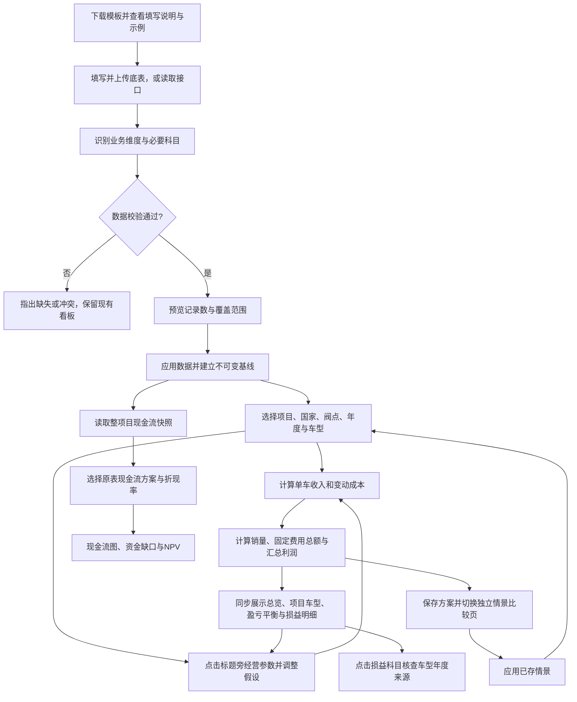

# BC 经济性分析看板 · 业务逻辑说明

版本：1.5　日期：2026年9月7日

本文面向业务使用者，说明看板为什么这样计算、各项功能按什么顺序工作，以及一个变量如何影响后续结果。内置数据来自《BC测算分析模板-线下.xlsx》，属于模板示例，不能视为实际经营实绩。

个人网站访问地址为 `https://yinpengtao.cn/checkmi/`。直接输入地址即可打开，首页、导航和财务工具目录不设置入口。这里保留同一套经营计算、标题旁的经营参数调整、独立情景比较、项目与车型表现、盈亏平衡分析、模板下载，以及完整损益明细；发布位置不改变任何业务口径。上传的数据与已存情景仍只保留在当前页面会话。

## 一、看板回答哪些业务问题

1. **这个项目在所选年度、车型及业务范围内能产生多少收入和利润？** 用销量、净收入、毛利率、EBIT、净利润五个指标展示结果。
2. **利润主要被哪些成本与费用消耗？** 用年度经营图、利润瀑布图和车型贡献表解释结果，并在损益明细页逐项核查。
3. **如果价格、销量或成本发生变化，经济性会怎样变化？** 点击标题旁的“经营参数”后调整假设，所有经营结果和损益明细同步更新；保存方案后用柱状图、年度折线图和明细表比较。
4. **老板如何检查每个车型的底层数据？** “损益明细”页从Sales、MIX一路展开到EBIT，提供单车金额、占收入比例、项目加权平均和来源记录。
5. **建设投入之后，现金何时逐步收回？** 展示原 Excel 的年度现金流、累计现金流和折现后的净现值。由于原表有两套差异明显的现金流算法，本版将它们分开展示。

默认页面展示全生命周期。金额统一使用人民币；原表中的单车金额按“元/台”理解，汇总金额主要展示为“亿元”，销量主要展示为“万台”。含税售价与现金流有其独立含税口径，不能直接与不含税利润表相加。

## 二、原 Excel 的结构与各表职责

工作簿共有17张工作表，其中6张隐藏。它并非一张已经完全打通的数据库：有的表是规则说明，有的是示例底表，有的是测算结果，还有历史版本与占位页。

| 工作表 | 业务职责 | 本版如何使用 |
|---|---|---|
| BC测算模板 | 5个车型 × 5个经营年度，以及年度和生命周期加权结果 | 经营分析与情景计算的主要基线 |
| 输入数据模板 | 国家、大区、驾驶位、出口模式、项目、状态、阀点、车型、部门、科目，按年度填写数值 | 用于理解未来数据接入结构；当前示例仅有BOM，不能独立计算利润 |
| 科目属性定义 | 科目含义、提供方、固定/变动性质、可控性与阀点要求 | 用于解释成本行为及参数关系 |
| 计算逻辑-511 | 较新的国内/海外科目、选装与操盘口径说明及示例 | 作为业务定义参考；未直接替换主测算表算法 |
| 计算逻辑、计算逻辑-新 | 早期口径与示例，均隐藏 | 辅助识别规则演变及差异 |
| 财务指标 | 当前阀点与目标、不同阶段的指标框架 | 参考指标体系；18%毛利率是目标示例，不作为所有项目的统一考核线 |
| 毛利率目标制定 | 不同配置的价格、成本、毛利与目标降本关系 | 解释目标成本思路；暂未上线独立目标成本反推功能 |
| 现金流及投资回收期 | SOP前三年投入、五年经营现金流、NPV、IRR、回收期 | 展示两套原表现金流快照，并支持修改折现率 |
| 车型总投资-立项 | 部门、费用类别与生命周期投资预算 | 用于理解投资构成，尚未与情景利润强行关联 |
| 阀点变化底稿、阀点变化展示 | 比较当前与上一阀点的部门投资变化；展示页隐藏 | 用于理解版本管理；本版先通过阀点筛选隔离版本 |
| 一二三级科目 | 投资与费用的分级分类目录 | 作为科目字典来源 |
| 专用投资分析1、专用投资分析（待讨论） | 专用投资分析草稿，均隐藏 | 参考，不作为已确认计算口径 |
| 展示模板、-----> | 空白展示页与分隔页，前者隐藏 | 不参与计算 |

**不能把不同项目示例拼成一个真实项目。** 主测算表的车型A～E、输入模板中的Lemans项目、投资明细中的Modena项目是不同示例。没有明确对应关系时，不将它们自动连接。

## 三、业务处理的串行顺序

### 1. 接入与识别

支持三种入口：

- **完整Excel**：识别原结构的“BC测算模板”，读取5个年度、5个车型的25条明细，而不是把横向合计列当作新增业务记录。
- **标准底表**：CSV、JSON或标准Excel。下载模板有“填写说明”“数据填写”“填写示例”三页，系统优先读取“数据填写”，不会把说明或示例算作业务数据；其他标准Excel读取第一张表。支持模板中文表头及接口英文字段。每条记录代表一个“项目 × 国家 × 阀点 × 车型 × 年度”。单车成本以正数输入，系统统一转换为扣减项。
- **数据接口**：主动读取用户指定的HTTPS JSON地址，使用与标准底表相同的业务字段。当前支持允许浏览器访问、无需私密密钥的接口；不代表已经连接任何企业经营系统，也不自动定时刷新。

文件在当前浏览器解析。导入前展示覆盖范围；点击“应用此数据”后才替换当前基线，同时重置情景参数与本次会话保存的情景。刷新页面会恢复内置模板数据，上传内容和情景不会自动永久保存。

### 2. 校验

检查必要字段、数值有效性、重复记录、售价与销量边界，以及关键收入/利润合计。完整Excel还检查指定行的科目名称、固定与变动费用的合计。读到没有计算结果的公式时，要求先在Excel中重算保存。

**缺失不等于零。** 必要科目缺失会停止导入；确实无发生额的标准底表科目必须填0。原完整模板中的空白预留行，可以按其原计算结构视为0。

当前原始“输入数据模板”只有BOM成本，缺销量、售价、制造费用、研发分摊等信息。系统会提示补齐，不以其他项目的数据填补。

### 3. 选择分析范围

年度与车型筛选同时影响经营总览、损益明细和结果导出。各经营页面的参数与筛选是同一组设置，切换页面不会建立另一套假设。多项目或多国家底表还可按对应维度筛选。存在多个阀点时，默认选取导入记录中的第一个阀点，用户可以切换；不会把不同阀点的同一业务重复汇总。第一个阀点不一定是最新阀点，使用时应确认版本。

没有数据的筛选组合显示无数据提示。现金流快照属于独立的整项目视图，不跟随这些经营筛选。

## 四、指标计算链路

### 1. 从量价到收入

单车净收入 = MSRP含税售价 + VAT扣减 + 收入抵减项。

在主表的13%增值税假设下，VAT扣减 = −MSRP ÷ 1.13 × 13%。收入抵减包括积分权益、展车折扣、金融贴息、购置税补贴等，原主表按固定单车金额输入。

总净收入 = 各车型各年度的单车净收入 × 对应销量，再加总。

**售价变化的联动：** VAT随售价变化；质保金按基线售价比例联动；消费税随净收入变化；城建及教育附加税随VAT、BOM进项和消费税联动。本版的金融贴息等抵减项仍按主表的固定金额处理，只有单独调整“收入抵减”时才改变。说明页上的其他公式不会未经确认自动覆盖主表。

### 2. 从收入到毛利

毛利 = 净收入 − 成本总额。

本版成本包含：BOM、单列赠送配置、税金、制造费用、运费保险清关、质保金、其他成本。损益表保留费用负数扣减关系；瀑布图用减少方向表示费用影响。

税金主要保留原主表逻辑：消费税按净收入的基线比例计算；城建及教育附加税按12%的模板系数计算；关税等未单独调整的原输入维持单车金额。**这些是模板参数与建模口径，不是税务政策判断。** 标准底表采用国内BC税费算法；海外转移定价、CIF、惩罚性关税等需要单独扩展。

### 3. 从毛利到EBIT

EBIT = 毛利 − 研发费用分摊 − 销交服费用 − 市场费用 − 其他已计入费用。

EBIT用于衡量经营利润，不考虑利息等财务费用。原主表第70行虽然列出了集团分摊，但未进入第53行费用合计。因此默认基线不包含它；用户打开“将集团分摊计入费用”后，才在情景中扣减。默认按原表0.2%的净收入比例联动，实际导入数据使用自身基线比例。

### 4. 从EBIT到净利润

所得税 = max(年度EBIT, 0) × 所得税率。

净利润 = EBIT − 所得税，默认税率15%。先在同一项目、国家、年度内汇总所选车型，再计税；不同项目、国家和年度分别计算后加总。模型不确认亏损产生的税收收益，不计算跨年亏损弥补。

车型筛选后的净利润，是该业务范围独立计算的情景结果。若各车型有盈有亏，分别筛选得到的税后利润，可能不等于整项目净利润；这是计税范围改变造成的，不能直接相加。

### 5. 加权与汇总

| 指标 | 汇总方法 | 避免的误区 |
|---|---|---|
| 销量 | 明细销量相加 | 不加入已经汇总的Average或生命周期合计列 |
| 净收入、毛利、EBIT | 各条记录的金额加总 | 不将元/台直接当成项目金额 |
| 单车净收入、单车EBIT | 总金额 ÷ 总销量 | 不对不同销量车型做简单平均 |
| 毛利率 | 总毛利 ÷ 总净收入 | 不直接平均各车型毛利率 |
| 销量占比MIX | 车型销量 ÷ 当前范围总销量 | 生命周期占比使用整个生命周期销量 |
| 生命周期净利润 | 各年度、项目、国家税后利润加总 | 不先把全部年份盈亏抵消再统一计税 |

零销量时，单车指标显示“—”；在固定总额模式下，固定费用仍然发生，因此EBIT可以为负。总收入为零时，毛利率显示“—”。

## 五、顶部经营参数与情景比较如何工作

### 可调整的业务变量

| 变量 | 改变什么 | 主要影响路径 |
|---|---|---|
| 含税售价 | 所选明细的MSRP统一按比例变化 | 净收入、VAT、消费税、附加税、质保金、毛利、利润 |
| 销售数量 | 所选明细销量统一按比例变化，保留原车型MIX | 收入、变动成本、固定费用单车分摊、利润 |
| BOM单车成本 | 第20行BOM金额按比例变化 | 材料成本、进项税相关附加税、毛利、利润 |
| 固定制造费用 | 固定制造费用总额或单车金额按所选模式变化 | 制造费用、毛利、利润 |
| 研发投入 | 研发分摊基线形成的总额或单车金额变化 | EBIT、净利润；本版不直接改变投资现金流计划 |
| 收入抵减 | 现有抵减金额绝对值按比例变化 | 净收入、消费税、附加税、毛利、利润 |

调整显示为“相对基线的百分比”。例如BOM为−5%，表示成本下降5%；收入抵减为+10%，表示优惠抵减扩大10%，通常降低利润。所有变量作用于当前筛选明细，并保留原始基线不变。

改善假设与承压假设是便于开始比较的预设组合，不是预算、预测或概率判断。变量之间没有自动需求弹性：例如涨价不会自动降低销量，用户应自行输入其销量判断。

### 固定费用的两种业务假设

**默认：固定总额不变。** 用“基线单车固定费用 × 基线销量”还原固定总额，再按情景销量分摊。此规则同时适用于固定制造、研发分摊、固定销交服。

例如基线5万台、固定制造4,000元/台，总额是2亿元。销量下降至4万台，若固定总额仍为2亿元，则单车固定制造费用变为5,000元。即使销量为0，2亿元仍作为成本发生。

**可选：单车费用不变。** 维持固定费用的单车金额，随销量成比例形成总额。以上例而言，4万台时总额变为1.6亿元。该模式更接近对原表单车数值做简单量变外推，但不代表固定资源一定能随销量缩减。

### 页面顺序与调整、查看、保存的顺序

页面顺序为：**经营总览 → 项目与车型 → 盈亏平衡 → 情景比较 → 现金流快照 → 损益明细 → 数据与口径**。数据与口径固定放在最后；损益明细继续提供完整核查能力。

1. 默认先展示经营数据。标题旁的“经营参数”是全局假设入口；打开右侧面板后修改含税售价、销售数量、BOM、固定制造费用、研发投入或收入抵减。输入或滑动立即生效，不需要另点“应用”。
2. 同一组结果同时更新指标卡、年度图、利润瀑布、项目与车型、盈亏平衡、完整损益表，以及情景比较中的当前试算。面板内同步展示当前EBIT与较基线差额。现金流快照不跟随经营参数。
3. 点击“加入情景比较”保存当时的业务筛选、全部参数与结果。保存后保留当前页面，可继续调参；点击“查看情景比较”关闭参数面板并进入独立比较页。比较页也可直接“保存当前情景”。
4. 最多保留最近4组情景。再次调参不会改写已存方案；可移除方案，也可点击“应用”同时恢复该方案的参数与业务范围。
5. 比较页用柱状图和年度折线图看差异，用明细表核查参数。跨项目、国家、阀点、年度或车型范围时，差额可能同时来自范围和参数，不能全部归因为参数变化。
6. 关闭参数面板只减少展示占用，不清空参数、筛选、当前结果或已存情景。标题旁入口保留已调整项数，方便判断当前数据是否仍为底表基线。切换经营页面也不会另建一套假设。
7. 导出当前结果或完整损益表可保留此次分析。上传并应用新底表会清空旧情景、恢复参数基线并关闭面板；刷新页面也会清空本次会话数据。

现金流仍是独立的原表快照。顶部经营参数联动上述经营结果；投资现金流需要另外的付款与投资计划，边界见第七节。

### 情景比较的图表与明细怎么配合

进入“情景比较”页后，比较图默认同时展示“底表基线”“当前试算”和最多4组已存情景。即使还未保存，也可以先比较基线与当前调参结果。

- **利润规模柱状图**：每组方案并列展示EBIT和净利润，统一为亿元，保留负值与零基准线。先看方案之间的利润差额，不把不同指标放在不同刻度上。
- **年度利润折线图**：每组方案一条线，可切换EBIT或净利润。用同一组年度坐标查看差异集中出现在哪一年，不改变经营假设。只覆盖一个年度时显示数据点。
- **选择参与比较的方案**：点击方案名称显示或隐藏该方案，同时作用于两张图。只改变比较对象，不改变顶部参数、业务筛选或已存结果，至少保留一组可见方案。
- **图表对应数值**：可展开查看所有可见方案的总EBIT、总净利润和逐年数据。图形难以区分时，用数值核对。
- **已存情景明细表**：保留全部业务范围、量价成本假设、固定费用模式、集团分摊开关、税率和结果；与图中的“已存1～4”一一对应。应用方案时，当前试算会恢复该方案的条件；移除后，该方案同时退出图和表。

经营参数变化只更新“当前试算”，筛选变化同时更新当前试算与同范围基线。已存情景始终使用保存时的范围和年度结果，不随当前筛选重新计算。新增方案后两张图自动加入该方案。

方案覆盖的项目、国家、阀点、车型或年度不同时，会提示“业务范围不同”，避免把规模变化完全归因于参数。缺失的年度是空缺，不能画成零利润，也不跨空缺连接。相同结果的曲线会重合；不为增强视觉差异而改动数据。标准底表缺少记录与零销量但仍承担固定费用的方案也分别处理。

### 经营盈亏平衡点

固定总额模式下，使用当前售价、单位变动成本和车型结构，求使EBIT为0的销量。其原理为“固定费用总额 ÷ 加权单车边际贡献”。边际贡献不为正时不提供有限保本销量。单车费用不变模式下，不存在独立固定费用总额，本版显示不适用。

它是**经营保本销量**，不是投资现金流回收所需销量。没有产能数据时，也不表示该销量一定能够生产或销售。

## 六、图表与功能之间的关系

| 功能 | 依赖输入 | 输出和用途 | 影响其他功能 |
|---|---|---|---|
| 数据接入 | 完整Excel或标准底表 | 建立基线及可筛选业务维度 | 更新经营页面；如含现金流则更新现金流快照；清空旧情景 |
| 业务筛选 | 项目、国家、阀点、年度、车型 | 定义当前分析范围 | 总览、项目车型、盈亏平衡、比较中的当前试算、损益和导出统一变化 |
| 指标卡 | 当前范围与情景 | 汇总核心结果、对比基线 | 是各图表共同的核对总数 |
| 年度经营图 | 同一范围的基线及当前年度毛利、EBIT | 毛利与毛利比较，EBIT与EBIT比较；各自按年度展示 | 服从筛选与情景，关闭参数面板后仍可查看 |
| 利润瀑布图 | 毛利及各费用 | 解释毛利如何扣减成EBIT | 终点与EBIT指标卡一致 |
| 车型贡献表 | 车型销量、收入和利润 | 比较单车盈利和规模贡献 | 点击车型会缩小全局经营范围 |
| 标题旁经营参数 | 基线及用户判断 | 计算量价成本变化结果 | 联动全部经营指标；不改变现金流快照 |
| 情景比较（独立页面） | 同范围基线、当前试算、已存范围与结果 | 柱状图看利润规模，折线图看年度差异，明细核查假设 | 两图共同选择比较对象；应用情景恢复参数与筛选 |
| 项目与车型 | 当前范围及同范围基线的车型年度结果 | 项目卡片、单车盈利、利润贡献、亏损组合核查 | 合计回到总览EBIT；点击车型带入完整范围查看损益 |
| 盈亏平衡 | 当前EBIT、固定费用及底表销量结构 | 保本销量、安全边际、覆盖倍数、年度费用覆盖 | 跟随参数；不改变现金流，不自动调整MIX |
| 结果导出 | 当前业务范围与情景 | 带来源、筛选、参数、明细和汇总的CSV | 便于复核；不修改底表 |
| 现金流分析 | 整项目原表现金流与折现率 | 年度、累计、资金缺口、NPV | 仅在本页面内联动 |
| 数据与口径（最后一页） | 原表结构、模型规则、审阅问题 | 下载填写模板、查看字段含义及业务说明 | 帮助建立正确底表与解释差异 |
| 损益明细 | 同一组经营结果与底表明细 | 按车型、MIX、科目核查从Sales到EBIT | 与总览合计一致；支持基线差额和底层来源检查 |

### 新增评审板块：项目与车型

该页面回答“哪些业务组合贡献利润，哪些组合仍然亏损”。先按 **项目 × 国家 × 阀点** 形成经营卡片，再按 **项目 × 国家 × 阀点 × 车型** 展开车型。不同项目、国家或阀点里的同名车型分别列示，不因为名称相同就合并。

- **项目卡片**：展示销量、净收入、EBIT、较同范围底表基线的EBIT差额，以及亏损车型组合数。
- **单车盈利与利润贡献**：两张图分别看单车EBIT（元/台）与EBIT总额（亿元）。按净收入排序展示前10个组合；图中序号与下方全量表一致，避免同名车型混淆。
- **销量MIX**：车型组合销量 ÷ 当前筛选范围总销量。全周期采用跨年实际销量加总，不简单平均每年MIX。
- **亏损组合**：只累计EBIT为负的车型组合，显示负金额；盈利组合不会抵消这一项。它是需要核查的范围，不代表项目整体必然亏损。
- **钻取损益**：点击车型同时带入项目、国家、阀点和车型，保留原年度选择，进入对应完整损益表。

项目与车型EBIT可以加总回总览。这里不拆分税后净利润，以免跨亏损车型计税后失去可加性。零销量时单车EBIT与MIX留空，固定总额模式下的亏损仍然保留。

### 新增评审板块：盈亏平衡

该页面回答“目前销量是否足以覆盖固定费用，最需要关注哪个年度”。使用与经营总览同一组量价成本假设。

1. 固定费用 = 当前计入的固定制造费用 + 研发分摊 + 固定销交服，展示为费用正金额。
2. 贡献额 = EBIT + 固定费用，所以 **贡献额 − 固定费用 = EBIT**。它代表扣除变动成本与变动费用之后，可用于覆盖上述固定费用的金额。
3. 在固定总额模式下，用当前量价成本和底表车型年度结构，求使EBIT为0的销量；调节销量只按该结构同比缩放，不自动优化MIX。
4. 销量余量 = 当前销量 − 保本销量；负数表示距离保本还差多少。销量安全边际 = 销量余量 ÷ 当前销量。
5. 固定费用覆盖倍数 = 贡献额 ÷ 固定费用；1倍表示刚好覆盖，低于1倍表示尚未完全覆盖。
6. 逐年柱状图对比贡献额与固定费用，差额即当年EBIT。明细表同时列各年销量、保本销量、销量余量与费用；各年使用各年的车型结构，全周期使用全周期结构，两类保本点不要求简单相加。

边界：单车费用不变模式没有独立固定总额保本点，保本销量、安全边际和覆盖倍数留空并解释原因。单位贡献不为正时不提供有限保本销量。底表无正销量时无法推导单位贡献；当前情景为零销量时，固定费用仍发生，但安全边际百分比不除以零。固定费用为零时覆盖倍数留空。这些结果均不代表投资现金流回收期，也不保证市场需求或产能可以达到保本销量。

经营总览新增三个快捷组件：销量最高车型组合的MIX、亏损车型组合数、销量安全边际；点击可进入上述两页继续分析。

### 生命周期经营表现的分组方式

生命周期经营表现按指标拆成两组：一组看毛利，一组看EBIT，每组内部按年度排列。有差异时，同一年度的基线毛利与当前毛利并排，基线EBIT与当前EBIT并排。与基线一致时只显示一组当前值，并明确标注一致，避免重复绘制相同柱子。

两组均使用亿元，分别标明坐标刻度，不混放毛利与EBIT。当前数值来自与指标卡、损益表相同的计算结果，基线来自同一筛选范围的底表。关闭参数面板或切换页面只改变展示，不改变这些数据。

### 标准模板怎么填写

“数据与口径”和“接入数据”窗口均提供Excel模板下载。模板的“数据填写”页初始为空，保留第1行中文字段名，从第2行填入真实数据。“填写示例”是独立参考页，不会自动进入看板；把示例复制到数据填写页测试时，结果仍然是示例。

- 一行是一组“项目 × 国家 × 阀点 × 车型 × 年度”，不要填写合计行。最多2,000条记录，上传文件不超过10 MB。
- 必填22项：项目、国家、阀点、车型、年度、销量、含税售价、BOM、收入抵减、赠送配置、固定制造、变动制造、运费保险清关、质保费率、其他成本、研发分摊、固定销交服、变动销交服、市场费用、增值税率、消费税率、集团分摊率。
- 金额填正数元/台，销量填台。售价含增值税，成本和收入抵减不含增值税。费率按小数填写，例如0.13表示13%，Excel百分比单元格中输入13%也会按0.13读取。无发生额显式填0。
- 标准模板中的BOM不包含另列赠送配置，避免重复；原始完整BC工作簿的历史口径另行保留。
- MIX、收入、毛利与EBIT由底表计算，不需手工填写。标准模板不含子科目拆分和投资现金流；需要原有全部子科目时导入完整BC工作簿。
- 模板说明页逐项给出单位、示例和业务含义；网页同样可展开查看。CSV填写示例和JSON接口示例保留在接入窗口。

### 完整损益表的核查规则

这页按原BC表的顺序展示Sales销量、MIX、MSRP、VAT、收入抵减及子项、净收入、BOM与赠送配置、税金、固定/变动制造及子项、运费保险清关、质保、其他成本、毛利、研发、变动/固定销交服、市场费用、集团分摊与EBIT。科目列和表头固定，支持横向、纵向滚动查看大表。

| 查看方式 | 业务意义 |
|---|---|
| 按车型汇总 | 每个项目、国家、阀点内分别形成车型列，避免同名车型混在一起 |
| 按车型×年度展开 | 每条车型年度记录独立成列，可直接对照原始记录 |
| 单车（元/台） | 当前范围科目总额除以销量；跨年按实际销量加权 |
| 总额（万元） | 直接查看所选范围发生总额，固定费用在零销量时仍可见 |
| 占净收入 | 对应科目金额除以对应车型或项目净收入，费用占比保留负号 |
| 当前情景 / 底表基线 / 较基线差额 | 在同一张表核对现状与调参影响；差额是情景减基线，占比差额按百分点表示 |
| 项目合计 / Average | 总额直接汇总；单车数按总销量加权；毛利与EBIT总额对应总览卡片 |
| 点击科目 | 展开项目、国家、阀点、车型、年度、底表原值、基线/情景销量与计入金额、来源位置 |
| 导出完整损益表 | 保存当前显示口径、所有列和所有科目，附数据来源、筛选与经营假设 |

MIX使用当前分析范围销量作为分母；总销量为0时不定义占比。全局销量参数统一调整各记录，因此不会改变已有车型结构。如需改变车型MIX，应在底表中调整各车型销量后重新导入。

下层科目按所属项目的情景规则变化：收入抵减子项随抵减参数变化；BOM内部分项随BOM参数变化；固定制造及研发子项随相应参数和固定费用模式变化；其他变动子项随销量变化。上层合计直接使用总览的同一套经营计算，避免另建一套损益算法。

**不编造拆分明细。** 底表缺少子科目时显示“—”，未提供的拆分金额列在“未分配 / 合计差额”。原表子项与父项不一致时，也单独列出差额，保留原有合计。第21、23行重复标签保留并说明；BOM与单列赠送配置不自动去重。集团分摊行展示实际计入金额，未开启时为0，底表原值仍可通过点击科目查看。

明细比率无有效分母时显示“—”。损益表到EBIT结束，净利润继续按第四节的项目、国家、年度税基计算，避免把车型税后利润简单相加。

## 七、现金流与投资的口径

原表覆盖SOP−3、SOP−2、SOP−1和SOP至SOP+4，共8个年度。原表现金流单位为万元，看板统一转换为元进行计算、亿元进行展示。

NPV = 首期现金流 + 后续各期现金流按所选折现率逐年折现的合计。首期SOP−3设为t=0，默认9%。最大累计资金缺口是累计现金流最低点的绝对值，最低点不低于0时为0。

本版区分“方案一·第64行”与“方案二·第97行”，不替用户认定哪套正确。默认模板中9%折现对应NPV分别为 **−8.86亿元** 与 **51.65亿元**。数值差异来自现金流算法，并非仅因“百万元”和“亿元”的显示单位不同。

原表方案一的IRR约5.52%、回收期约4.53年保留为原表参考说明。由于回收期公式含9月上市及特定年份引用，本版没有将其作为动态情景输出。

**经营参数尚未推导投资现金流。** 研发分摊变化不能直接等同于某一年研发付款；制造折旧不能直接等同于当期资本开支；应收应付账期、所得税付款及营运资金也需要独立计划。在这些关系确认前，不用EBIT简单替换现金流来生成新的投资结论。

## 八、本次发现的源表口径问题

| 问题 | 原表定位 | 本版处理 |
|---|---|---|
| 后续年份的部分售价加权使用SOP销量或分母 | BC测算模板：AK8、BU8、CM8 | 按本年度明细销量重新汇总；当前各年相同所以基线一致 |
| BOM与赠送配置可能重复计入；D21、D23标签重复 | BC测算模板：D19:D23 | 保留第20行和第23行基线，明确披露，不擅自去重 |
| 集团分摊未进入费用合计 | BC测算模板：D53、D70、D71及对应年度列 | 默认复现，情景可选择纳入 |
| 车型所得税及净利润空白，部分生命周期车型列由空白推得0 | BC测算模板：D72:P73、CP72:DB73；年度合计S72:S73有值 | 采用年度经营汇总后计税，不把车型空白当作真实零利润 |
| 现金流方案二可能重复计入EBIT | 现金流及投资回收期：J76、J87、J97 | 两方案单独展示，不宣布其投资结论已确认 |
| 模具折旧映射到燃动成本；用户权益出现重复引用；集团分摊仅取车型A | 同表：J39、J55:J56、J61 | 原现金流作为快照，等待确认映射后再联动 |
| 回收期和投资保本点使用特定年份/月份公式 | 同表：G66:G67、G100 | 不将该公式直接扩展为通用情景算法 |
| 说明页和主表存在不同版本口径；选装、操盘处理不统一 | 计算逻辑-511、科目属性定义、BC测算模板 | 主表是基线；说明页提供解释，未混用重算 |

没有发现缓存结果中的常见Excel错误值，不代表这些业务口径问题不存在。原始Excel保持不变。

## 九、已核对的基线结果

| 指标 | SOP年 | 全生命周期 |
|---|---:|---:|
| 销量 | 23.00万台 | 115.00万台 |
| 净收入 | 422.21亿元 | 2,111.07亿元 |
| 毛利 | 35.46亿元 | 177.32亿元 |
| 毛利率 | 8.40% | 8.40% |
| EBIT | 7.86亿元 | 39.32亿元 |
| 净利润 | 6.68亿元 | 33.42亿元 |

核对来源：BC测算模板年度合计S6、S18、S52、S71、S73，以及生命周期DE6、DE18、DE52、DE71、DE73；总额由单车数乘以对应销量得到。本版经营明细先逐条重算，再核对合计，不直接将原Average列作为全局计算依赖。

## 十、后续业务确认顺序

1. 先确认BOM与赠送配置是否重复、集团分摊是否应进入EBIT，以及选装与操盘的管理/业绩口径。
2. 再明确研发与固定费用的可变程度、产能约束，以及各项目的税费参数。
3. 明确底表唯一键、阀点版本与不同项目示例的对应关系，确定真实接口的责任部门和更新频率。
4. 最后统一投资现金流算法，补齐付款节奏、资本开支、折旧加回、营运资金与税务现金流，再让经营情景联动NPV、IRR和回收期。

上述确认顺序决定功能之间的依赖，避免在前置口径尚未统一时，先得出看似精确的投资结论。

